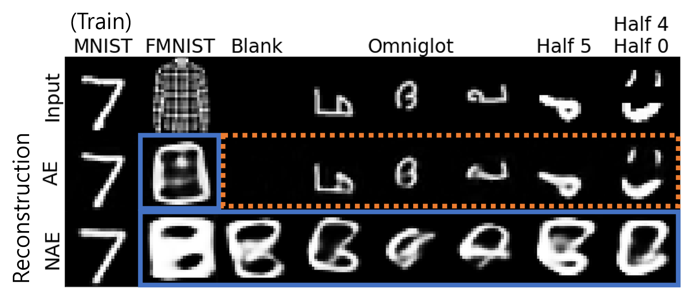

# Autoencoding Under Normalization Constraints

The official repository for &lt;Autoencoding Under Normalization Constraints> (Yoon, Noh and Park, ICML 2021).

> The paper proposes Normalized Autoencoder (NAE), which is a novel energy-based model where the energy function is the reconstruction error. NAE effectively remedies outlier reconstruction, a pathological phenomenon limiting the performance of an autoencoder as an outlier detector.

Arxiv: https://arxiv.org/abs/2105.05735  
5-min video: https://www.youtube.com/watch?v=ra6usGKnPGk




## Progress

- [x] Unit tests (`tests/`)
- [x] Training script (`train.py`)
- [x] OOD detection performance script  (`evaluate_ood.py`)
- [x] Sampling script (`sample.py`)
- [x] Pretrained models for MNIST, CIFAR-10, CelebA64
- [ ] 2D Experiments
- [ ] MNIST hold-out experiments
- [ ] Pretrained models for MNIST hold-out and ImageNet32
- [ ] Generating Noise dataset on-the-fly
- [ ] Reproducible environment (conda environment or docker)

Updates on the repository and the releases of other materials will be broadcasted through the mailing list. If you want to be kept in touch, please sign up for [the mailing list](https://mailchi.mp/32e7ca8a0a85/autoencoding-under-normalization-constraints).

## Requirements

### Environment

The project is developed under a standard PyTorch environment.

- python 3.7.2
- numpy
- pillow
- pytorch 1.7.1
- CUDA 10.1
- scikit-learn 0.24.2
- tensorboard 2.5.0
- pytest 6.2.3


### Datasets

All datasets are stored in `datasets/` directory.

- MNIST, CIFAR-10, SVHN, Omniglot : Retrieved using `torchvision.dataset`.
- Noise, Constant, ConstantGray : [Dropbox link](https://www.dropbox.com/sh/u41ewgwujuvqvpm/AABM6YbklJFAruczJPhBWNwZa?dl=0)
- [CelebA](https://mmlab.ie.cuhk.edu.hk/projects/CelebA.html), [ImageNet 32x32](http://image-net.org/small/download.php): Retrieved from their official site. I am afraid that website for ImageNet 32x32 is not available as of June 24, 2021. I will temporarily upload the data to the above Dropbox link.

When set up, the dataset directory should look like as follows.

```
datasets
├── CelebA
│   ├── Anno
│   ├── Eval
│   └── Img
├── cifar-10-batches-py
├── const_img_gray.npy
├── const_img.npy
├── FashionMNIST
├── ImageNet32
│   ├── train_32x32
│   └── valid_32x32
├── MNIST
├── noise_img.npy
├── omniglot-py
│   ├── images_background
│   └── images_evaluation
├── test_32x32.mat
└── train_32x32.mat

```

### Pre-trained Models

Pre-trained models are stored under `pretrained/`. The pre-trained models are provided through the [Dropbox link](https://www.dropbox.com/sh/u41ewgwujuvqvpm/AABM6YbklJFAruczJPhBWNwZa?dl=0).

If the pretrained models are prepared successfully, the directory structure should look like the following.

```
pretrained
├── celeba64_ood_nae
│   └── z64gr_h32g8
├── cifar_ood_nae
│   └── z32gn
└── mnist_ood_nae
    └── z32
```

## Testing

PyTest is used for unittesting.

```
pytest tests
```

The code should pass all tests after the preparation of pre-trained models and datasets.

## Running

**OOD Detection Evaluation**

```
python evaluate_ood.py --ood ConstantGray_OOD,FashionMNIST_OOD,SVHN_OOD,CelebA_OOD,Noise_OOD --resultdir pretrained/cifar_ood_nae/z32gn/ --ckpt nae_9.pkl --config z32gn.yml --device 0 --dataset CIFAR10_OOD
```

<details>
  <summary>Expected Results</summary>

  ```
  OOD Detection Results in AUC
  ConstantGray_OOD:0.9632
  FashionMNIST_OOD:0.8193
  SVHN_OOD:0.9196
  CelebA_OOD:0.8873
  Noise_OOD:1.0000
  ```
</details>


**Training**

```
python train.py --config configs/mnist_ood_nae/z32.yml --logdir results/mnist_ood_nae/ --run run --device 0
```

```
python train.py --config configs/cifar_ood_nae/z32gn.yml --logdir results/cifar_ood_nae/ --run run --device 0
```

## Citation

The bibtex will be updated to the official ICML version once the proceedings are out.

```
@article{yoon2021autoencoding,
  title={Autoencoding Under Normalization Constraints},
  author={Yoon, Sangwoong and Noh, Yung-Kyun and Park, Frank Chongwoo},
  journal={arXiv preprint arXiv:2105.05735},
  year={2021}
}
```
